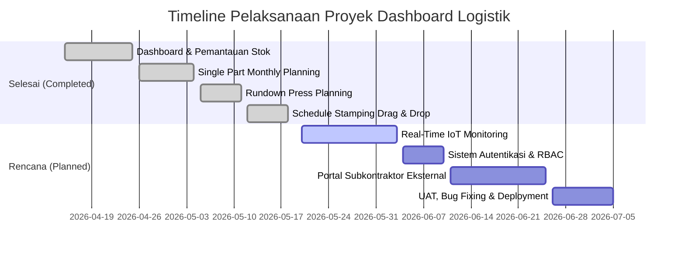

# LAPORAN PROGRES & JADWAL PELAKSANAAN PROYEK
## DASHBOARD LOGISTIK IPPI-PPLC

> [!NOTE]
> Laporan ini disusun secara profesional untuk merangkum riwayat pengerjaan fitur-fitur yang telah selesai (**100% Selesai**), status pengembangan saat ini, serta estimasi tanggal penyelesaian (**Estimated Completion Date / ECT**) untuk modul-modul mendatang.

---

## 📊 RINGKASAN PROGRES PROYEK (PROJECT SUMMARY)

Aplikasi **Dashboard Logistik IPPI-PPLC** dirancang untuk mendigitalisasi pemantauan stok part, penjadwalan produksi press unit, dan sinkronisasi logistik secara real-time. Pengerjaan dibagi menjadi **8 Modul Utama**.

### PERSENTASE KESELURUHAN (OVERALL PROGRESS)
| Status Modul | Jumlah | Persentase | Status |
| :--- | :---: | :---: | :--- |
| **Selesai (Completed)** | 4 Modul | 50% | Kuat & Stabil (Produksi Teruji) |
| **Direncanakan (Planned)** | 4 Modul | 50% | Dalam Perencanaan Teknis |
| **Total Sistem** | **8 Modul** | **100%** | **Target Final: 5 Juli 2026** |

---

## 📅 JADWAL & STATUS FITUR SECARA RINCI (DETAILED SCHEDULE & ROADMAP)

| No | Modul / Fitur | Status | Tanggal Mulai | Tanggal Selesai / ECT | Rincian Fungsionalitas & Keterangan |
| :---: | :--- | :---: | :---: | :---: | :--- |
| **1** | **Dashboard & Pemantauan Stok (Stock level Monitoring)** | 100% SELESAI | 15 April 2026 | 25 April 2026 | **Sudah Siap Pakai:** • Visualisasi metrik stok (*Total, Over, Limited, Critical Stock*). • Grafik pergerakan Finish Part per customer (ADM SAP, ADM KAP, dll.). • Pengunggahan Excel Stok yang terintegrasi dengan Python parser (`python/read_xlsm.py`). |
| **2** | **Single Part Monthly Planning & Barcode Integration** | 100% SELESAI | 26 April 2026 | 04 Mei 2026 | **Sudah Siap Pakai:** • Perhitungan otomatis stok akhir berbasis kategori (*Single Part* vs *Finish Part*). • Auto-generate template tanggal baru berdasarkan sisa stok hari sebelumnya. • Integrasi barcode scanner (`PartNo\|JobNo\|Serial\|Date\|Time\|Qty`) untuk input incoming secara instan. • Edit inline dinamis (AJAX) dengan cascade stok otomatis ke tanggal-tanggal berikutnya secara kronologis. |
| **3** | **Rundown Press Planning** | 100% SELESAI | 05 Mei 2026 | 11 Mei 2026 | **Sudah Siap Pakai:** • Monitoring line Press (A, B, C, D) dengan formula produksi: `Stok Akhir = Stok Awal + Prod Aktual - Spare Part`. • Fitur sinkronisasi massal / tunggal dari hasil kalkulasi Rundown Press langsung ke kolom target rencana (*plan*) di *Schedule Stamping* secara real-time. |
| **4** | **Schedule Stamping (Drag & Drop / Break Cascading)** | 100% SELESAI | 12 Mei 2026 | 18 Mei 2026 | **Sudah Siap Pakai:** • Drag-and-drop interaktif untuk menyusun urutan pengerjaan jobs mesin press. • Penanganan istirahat otomatis (*Shift Pagi* & *Shift Malam*) yang memotong durasi kerja secara akurat. • Penanganan pergantian hari/tengah malam (*midnight transition*) menggunakan kalkulasi menit ternormalisasi. • Export data terformat rapi ke Excel dengan baris istirahat terarsir abu-abu otomatis. |
| **5** | **Real-Time Production Monitoring & IoT Integration** | Direncanakan (Planned) | 20 Mei 2026 | **03 Juni 2026** | **Rencana Pengembangan:** • Integrasi database dengan counter stroke mesin Press otomatis via sensor IoT. • Tampilan dashboard live chart OEE (*Overall Equipment Effectiveness*) untuk masing-masing Press A, B, C, D. |
| **6** | **Sistem Autentikasi & Hak Akses (RBAC)** | Direncanakan (Planned) | 04 Juni 2026 | **10 Juni 2026** | **Rencana Pengembangan:** • Pembatasan akses CRUD menggunakan Laravel Breeze/Sanctum. • Pembagian hak akses: *Admin Logistik* (penuh), *Operator Press* (input prod aktual), dan *Management/Viewer* (view only). |
| **7** | **Portal Integrasi Subkontraktor Eksternal** | Direncanakan (Planned) | 11 Juni 2026 | **25 Juni 2026** | **Rencana Pengembangan:** • Halaman khusus untuk subkontraktor luar (AAP, ALMINDO, CMM, dsb) untuk melihat instruksi supply part. • Fitur input pengiriman barang masuk (*incoming*) secara mandiri oleh vendor. |
| **8** | **UAT, Uji Coba, & Live Deployment** | Direncanakan (Planned) | 26 Juni 2026 | **05 Juli 2026** | **Rencana Pengembangan:** • Sesi *User Acceptance Testing* bersama tim logistik & operator lapangan. • Pembersihan bug akhir dan optimalisasi query database. • Deployment final ke server MAMP / Server Intranet IPPI. |

---

## 🛠️ STATUS IMPLEMENTASI DETAIL MODUL YANG SUDAH SELESAI

> [!TIP]
> Bagian ini menjelaskan secara rinci keunggulan teknis dari fitur-fitur yang sudah berhasil kita selesaikan, agar atasan atau pihak dosen memahami kedalaman arsitektur sistem yang telah dibangun.

### 1. Modul Dashboard & Pemantauan Stok
* **Fitur Utama:** Penyerapan file master logistik secara bulk, penentuan persentase ketersediaan komponen inhouse & subcont.
* **Keunggulan Teknis:** Penyerapan menggunakan script Python `python/read_xlsm.py` yang berjalan di background, mampu menangani file Excel berukuran besar hingga >50MB tanpa kendala timeout PHP memory.

### 2. Modul Single Part Monthly Planning
* **Fitur Utama:** Mengelola stok harian part sepanjang satu bulan dengan formula dinamis.
* **Keunggulan Teknis:**
  * **Algoritma Chronological Cascade:** Perubahan stok awal atau incoming pada tanggal 5 otomatis menghitung ulang sisa stok (stok akhir) pada tanggal 6, 7, 8, dan seterusnya hingga akhir bulan secara real-time.
  * **Smart Barcode Parser:** Scanner secara otomatis memisahkan data raw string scanner (misal `PART001|JOB123|SER098|20260519|1100|50`) menjadi data komponen independen dan langsung mengupdate quantity stock.

### 3. Modul Rundown Press
* **Fitur Utama:** Pengelolaan rencana produksi stamping per part, pencocokan stock awal, target, aktual dan spare part.
* **Keunggulan Teknis:** Menggunakan formula pemantauan murni yang mengecualikan MDFO dan rencana shift dari formula stok fisik aktual, menjaga integritas akurasi stock lapangan. Terintegrasi dengan satu tombol untuk mentransfer stok akhir sebagai input target ke antrian stamping.

### 4. Modul Schedule Stamping
* **Fitur Utama:** Penjadwalan produksi harian berbasis jam kerja dan istirahat mesin pres.
* **Keunggulan Teknis:**
  * **Break-Time Integrity Cascade:** Jadwal job yang durasinya menabrak jam istirahat otomatis dijeda (paused) dan start-finish dihitung ulang mundur sesuai durasi istirahat.
  * **Midnight Wrap-Around Calculation:** Algoritma internal menggunakan kalkulasi waktu berbasis total menit dari awal shift (misal 21:00 = 0 menit, 05:00 = 480 menit). Cara ini menjamin tidak terjadi error atau loop tak berujung saat jam berpindah melewati tengah malam (00:00).
  * **Interactive drag reordering:** Perubahan posisi antrean secara visual langsung memicu cascade kalkulasi waktu di database dalam hitungan milidetik.

---

## 📋 DAFTAR ESTIMASI TANGGAL SELESAI (ECT SUMMARY)

Bila ada pertanyaan mengenai **"Kapan modul sisa selesai?"**, berikut adalah jadwal target penyelesaian yang terdekat:

1. **IoT Stroke Counter Integration (OEE Live Monitoring):** Target selesai **03 Juni 2026**
2. **Autentikasi & Hak Akses User (RBAC):** Target selesai **10 Juni 2026**
3. **Portal Subkontraktor:** Target selesai **25 Juni 2026**
4. **Final Deployment & Testing (UAT):** Target selesai **05 Juli 2026**

---
*Laporan ini digenerate secara otomatis pada tanggal 19 Mei 2026 berdasarkan status codebase aktual di d:\MAMP\MAMP\htdocs\ippi-pplc - Copy\dashboard-logistik.*
