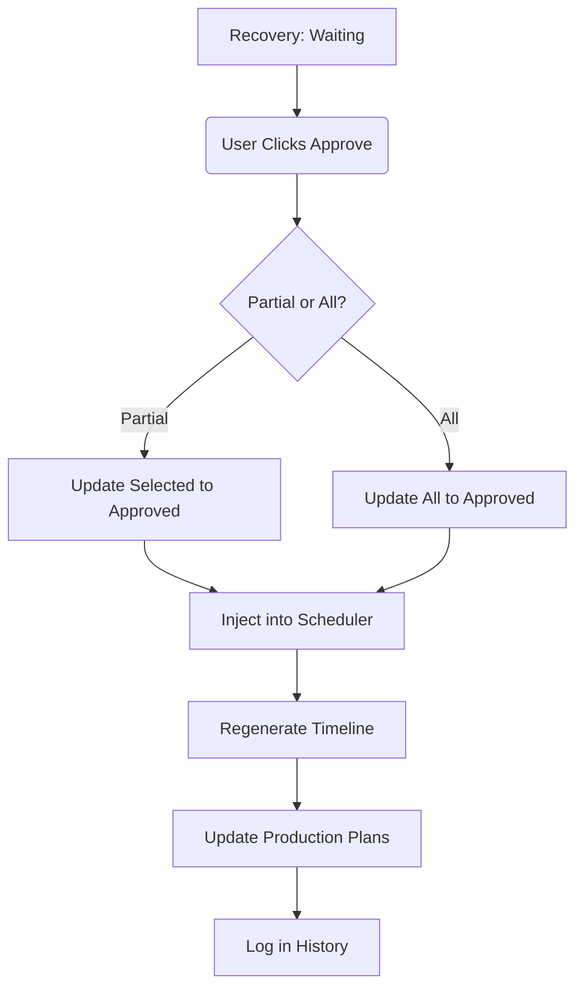
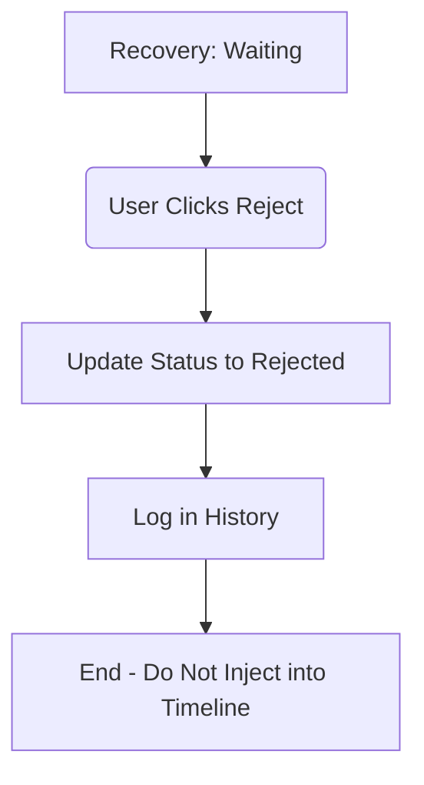
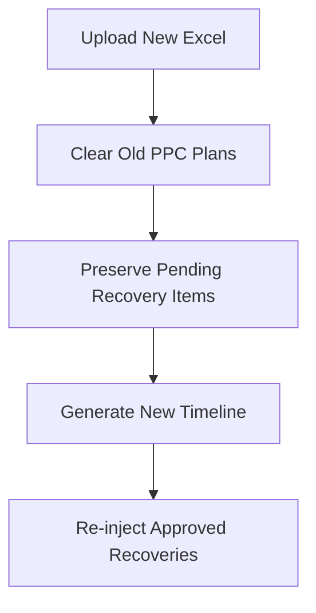

# Recovery Functional Specification

## 1. Flow: Approve Recovery

```mermaid
graph TD
    A[Recovery: Waiting] --> B(User Clicks Approve)
    B --> C{Partial or All?}
    C -->|Partial| D[Update Selected to Approved]
    C -->|All| E[Update All to Approved]
    D --> F[Inject into Scheduler]
    E --> F
    F --> G[Regenerate Timeline]
    G --> H[Update Production Plans]
    H --> I[Log in History]
```

## 2. Flow: Reject Recovery

```mermaid
graph TD
    A[Recovery: Waiting] --> B(User Clicks Reject)
    B --> C[Update Status to Rejected]
    C --> D[Log in History]
    D --> E[End - Do Not Inject into Timeline]
```

## 3. Flow: Upload Ulang Excel (Resilience)

```mermaid
graph TD
    A[Upload New Excel] --> B[Clear Old PPC Plans]
    B --> C[Preserve Pending Recovery Items]
    C --> D[Generate New Timeline]
    D --> E[Re-inject Approved Recoveries]
```
