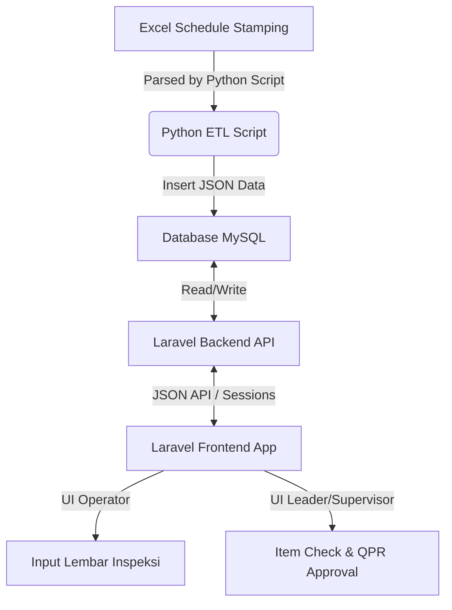

# DOKUMENTASI SISTEM QUALITY ASSURANCE (QA) - STAMPING PRODUCTION
Dokumen ini menyajikan panduan lengkap dari awal hingga akhir mengenai arsitektur, basis data, alur kerja, keamanan, dan cara menjalankan Sistem Quality Assurance (QA) terintegrasi pada lini produksi Stamping (Press A, B, C, D).

---

## 1. PENDAHULUAN & ARSITEKTUR SISTEM

Sistem ini dirancang untuk mendigitalisasi proses kontrol kualitas di pabrik stamping, menggantikan formulir kertas (Lembar Inspeksi) dengan aplikasi web real-time yang terintegrasi dengan sistem penjadwalan produksi.

### Komponen Utama:
1. **Backend (Laravel 12 API):** 
   * Lokasi: `backend/`
   * Fungsi: Mengelola basis data, logika bisnis utama, sistem autentikasi, manajemen otorisasi (RBAC), pembuatan laporan PDF/Excel, dan API endpoints.
2. **Frontend & Application Integration (Laravel + Vite):** 
   * Lokasi: `application_integration/`
   * Fungsi: Menyediakan antarmuka pengguna (UI/UX) untuk Operator, Leader, Supervisor, dan Admin.
3. **Data Ingestion (Python ETL):** 
   * Lokasi: `application_integration/scripts/read_schedule_stamping.py`
   * Fungsi: Membaca file jadwal stamping Excel (.xlsx/.xlsm), mengekstrak data dari 4 lini mesin press, dan mengirimkannya ke database backend.



---

## 2. STRUKTUR BASIS DATA (MODELS)

Sistem ini didukung oleh 12 Model Utama di dalam Laravel Backend (`app/Models/`):

1. **`User`**
   * Mengelola akun pengguna (operator, leader, supervisor, QC, admin).
   * Terintegrasi dengan Spatie Permissions untuk pembagian hak akses (RBAC).
2. **`ProductionLine`**
   * Menyimpan data mesin produksi (contoh: Press A, Press B, Press C, Press D).
3. **`ProductionSchedule`**
   * Menyimpan jadwal produksi yang diimpor dari file Excel. Berisi data job, shift, target rencana, dan status approval jadwal (`pending`/`approved`).
4. **`LiTemplate` (Lembar Inspeksi Template)**
   * Mengelola template checklist poin inspeksi produk. Berisi parameter dimensi, standar toleransi, dan defect checklist.
5. **`Lembarinspeksi`**
   * Log inspeksi utama yang diisi oleh operator. Mencatat waktu mulai/selesai inspeksi, aktual produksi, status kualitas, sketsa kecacatan, dan tanda tangan digital.
6. **`Inspection`**
   * Menyimpan detail data sampel per-jam dari lembar inspeksi (kalkulasi dimensi aktual, OK/NG status).
7. **`ItemCheck`**
   * Portal verifikasi untuk Leader/Supervisor guna melakukan double-check sampel yang telah diinput operator.
8. **`Qpr` (Quality Problem Report)**
   * Laporan khusus yang diterbitkan apabila ditemukan masalah kualitas berulang atau defect fatal saat proses inspeksi.
9. **`QprAction`**
   * Tindakan korektif dan preventif (CAPA) yang harus diisi untuk menyelesaikan masalah pada laporan QPR.
10. **`DefectMaster`**
    * Kamus database untuk jenis-jenis kecacatan (misal: Scratch, Dent, Crack, Rust).
11. **`IntercomCall`**
    * Fitur panggilan darurat real-time yang memicu notifikasi suara/visual saat terjadi masalah kualitas di lini produksi.
12. **`ApprovalToken`**
    * Token keamanan untuk validasi tanda tangan digital atasan.

---

## 3. ALUR KERJA UTAMA (WORKFLOW)

### A. Alur Ingestion Jadwal (Schedule Import)
1. File Excel rencana produksi (.xlsx) diunggah oleh admin/perencana produksi.
2. Script Python `read_schedule_stamping.py` dijalankan untuk mem-parsing data:
   * Mengidentifikasi blok mesin Press A-D secara otomatis.
   * Mendeteksi jam istirahat, break, atau pergantian shift.
   * Melakukan pembersihan data (*data cleaning*) dan normalisasi string.
3. Data dikirim ke database dengan status awal **`pending`**.
4. Supervisor meninjau jadwal di dashboard dan mengubah statusnya menjadi **`approved`** agar operator di lantai pabrik bisa mulai melakukan inspeksi pada jadwal tersebut.

### B. Alur Lembar Inspeksi (Operator)
1. Operator memilih jadwal aktif di dashboard sesuai shift dan mesin press mereka.
2. Operator mengisi form inspeksi secara real-time pada interval waktu yang ditentukan (misal tiap 1 jam):
   * Memasukkan hasil pengukuran dimensi produk.
   * Jika ada defect, operator mencentang jenis defect dari `DefectMaster` dan mengunggah sketsa foto kecacatan.
3. Sistem secara otomatis menghitung sampel yang harus diambil secara dinamis berdasarkan total produksi aktual.
4. Setelah shift selesai, Operator menandatangani secara digital (canvas-based signature) untuk menyelesaikan form.

### C. Alur Verifikasi & Approval (Leader / Supervisor)
1. Setelah operator mengirim Lembar Inspeksi, statusnya menjadi **`Pending Approval`**.
2. Leader membuka portal **`Item Check`** untuk memverifikasi produk secara fisik dan mencocokkan datanya dengan input operator.
3. Jika data cocok, Leader membubuhkan tanda tangan digital approval.
4. Jika ada ketidaksesuaian atau defect fatal, Leader dapat menolak (**`Reject`**) lembar inspeksi untuk diperbaiki oleh operator, atau menerbitkannya sebagai **`QPR`**.

### D. Alur Penerbitan QPR (Quality Problem Report)
1. Jika terjadi defect NG (No Good) berulang, sistem meminta pembuatan laporan **QPR**.
2. Bagian QA/QC mengisi detail masalah dan menganalisis akar penyebab (*Root Cause Analysis* - 5 Why/Fishbone).
3. QC mendefinisikan rencana tindakan korektif di model `QprAction` beserta penanggung jawab (*PIC*) dan batas waktu (*due date*).
4. Supervisor meninjau tindakan perbaikan, memverifikasi efektivitasnya di lapangan, dan menutup QPR (status **`Closed`**).

### E. Alur Panggilan Interkom (Emergency Call)
1. Jika di tengah produksi operator mendeteksi defect kritis yang berpotensi menghasilkan produk NG massal, operator menekan tombol **Interkom** pada tablet inspeksi.
2. Sistem mencatat panggilan di model `IntercomCall` dan membunyikan alarm visual/suara di dashboard Leader dan QC.
3. Leader segera mendatangi lini press tersebut untuk melakukan penanganan dan mematikan alarm interkom setelah masalah teratasi.

---

## 4. KEAMANAN SISTEM (CYBER SECURITY)

Sistem ini menerapkan standar keamanan aplikasi web modern:

1. **Session Fingerprinting (Pencurian Cookie / Session Hijacking):**
   * *Middleware* custom `SessionFingerprint` mendeteksi jika cookie `laravel_session` disalin ke browser/perangkat lain dengan memeriksa kecocokan hash `User-Agent` dan `IP Address`. Sesi akan otomatis dihancurkan (force logout) jika terjadi ketidakcocokan.
2. **HttpOnly Cookies:**
   * Mencegah pembacaan cookie sesi oleh script JavaScript eksternal (mengamankan dari serangan Cross-Site Scripting - XSS).
3. **SQL Injection Prevention:**
   * Penggunaan Eloquent ORM di Laravel secara default menggunakan PDO parameter binding untuk menetralisir input form yang mengandung query SQL berbahaya.
4. **CSRF Protection:**
   * Token CSRF diwajibkan di setiap request POST/PUT/DELETE untuk mencegah eksploitasi pemalsuan request dari luar aplikasi.

---

## 5. PANDUAN MENJALANKAN SISTEM

### A. Prasyarat (Prerequisites)
* XAMPP (PHP 8.2 ke atas, MySQL/MariaDB)
* Python 3.x (dengan library: `openpyxl`)
* Node.js & NPM

### B. Langkah Menjalankan Backend API:
1. Masuk ke direktori backend:
   ```bash
   cd backend
   ```
2. Salin file `.env.example` menjadi `.env` dan sesuaikan konfigurasi database Anda.
3. Install dependensi PHP:
   ```bash
   composer install
   ```
4. Jalankan migrasi database dan seeder data awal:
   ```bash
   php artisan migrate:fresh --seed
   ```
5. Jalankan server Laravel:
   ```bash
   php artisan serve --port=8080
   ```

### C. Langkah Menjalankan Frontend / Application Integration:
1. Masuk ke direktori frontend:
   ```bash
   cd application_integration
   ```
2. Install dependensi JavaScript:
   ```bash
   npm install
   ```
3. Jalankan server Vite development:
   ```bash
   npm run dev
   ```

### D. Menjalankan Python ETL Script (Import Jadwal):
Untuk mengimpor file Excel jadwal baru ke sistem:
```bash
python application_integration/scripts/read_schedule_stamping.py path/to/file_jadwal.xlsx
```
*Hasil parsing berupa JSON akan dikirimkan langsung ke database untuk dibaca oleh backend Laravel.*
